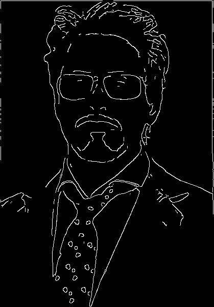

# Parallel Canny Image Edge Detector

## The Parallel Edge Detection Problem
### Task: Creates a fast parallel program that detects the edges of objects on an image.
### Methodology:
  - Write the program in CUDA C++ using a NVIDIA GPU and CUDA Toolkit on Northeastern's discovery cluster
  - Implement the steps of the Canny Edge Detector Algorithm in parallel
  - USe the OpenCV library to read and write image data

## Canny Edge Detector Algorithm
1. Noise Reduction with Gaussian Blur
   - Weighted average value of the surrounding pixels in grey scale
2. Gradient Calculation with Sobel Filter
   - Detects edge intensity and direction
3. Non-Maximum Suppression
   - Find picel with the maximum value in edge directions
4. Double Threshold
   - Identifies string, weak, and non relevant pixels
5. Hysteresis
   - Transforms weak pixels to strong or irrelevant pixels

## Results
### Input Image

### Image after Gaussian Blur

### Image after sobel filter

### Image afer Non-Maximum 

### Image after Double Threshold

### Final Image

